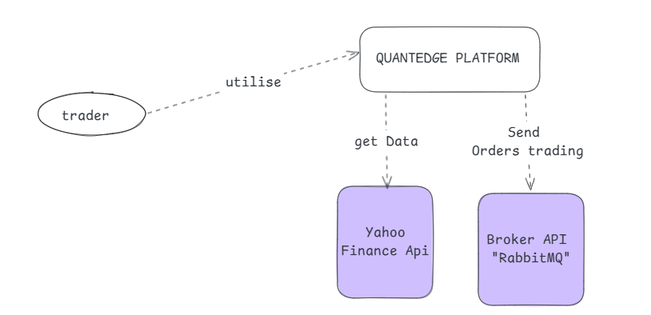
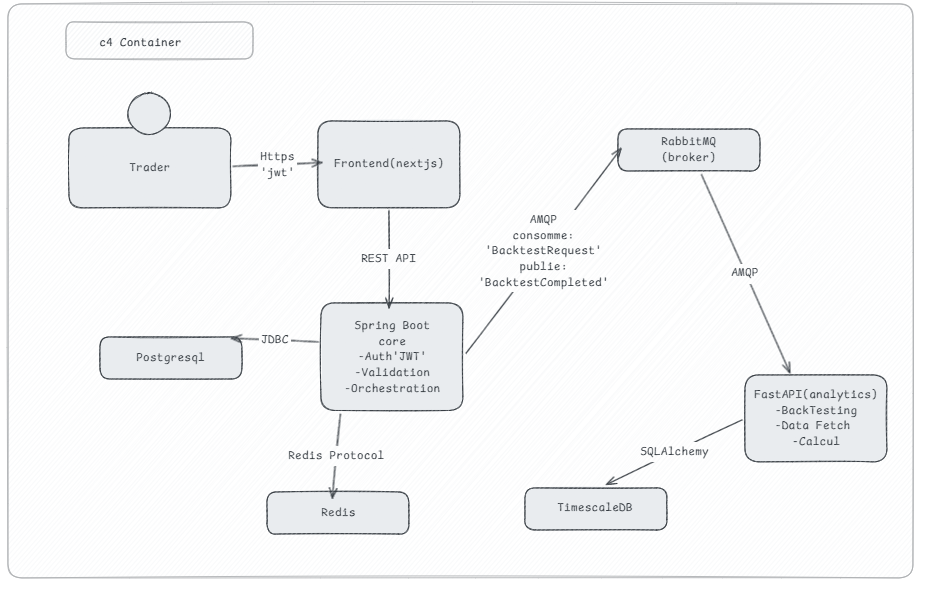

# 📊 QuantEdge - Plateforme de Trading Algorithmique & Backtesting

[](https://www.oracle.com/java/)
[](https://spring.io/projects/spring-boot)
[](https://fastapi.tiangolo.com/)
[](https://nextjs.org/)

> **QuantEdge** est une plateforme de trading algorithmique qui permet aux traders de créer, tester (backtesting) et analyser des stratégies de trading automatisées sur des données historiques.

🇬🇧 [Read in English](README.md) | 🇫 Français

---

## 🏗️ Architecture

### C4 Context Diagram


### C4 Container Diagram


---

## 🛠️ Stack Technique

| Composant | Technologie | Rôle |
|-----------|-------------|------|
| **Frontend** | Next.js 14 + TypeScript | Dashboard utilisateur, graphiques temps réel |
| **Core Backend** | Spring Boot 3.2 + Java 17 | Authentification (JWT), gestion des portfolios |
| **Analytics Engine** | FastAPI + Python | Backtesting, calcul d'indicateurs |
| **Message Broker** | RabbitMQ | Communication asynchrone entre microservices |
| **Base de données** | PostgreSQL | Stockage des données relationnelles |
| **Cache** | Redis | Sessions, tokens, données fréquentes |

---

## 🚀 Démarrage Rapide

### Prérequis
- Docker & Docker Compose
- Java 17+
- Node.js 18+
- Python 3.11+

### Installation

```bash
# Cloner le repo
git clone https://github.com/[TON_USERNAME]/quantedge-platform.git
cd quantedge-platform

# Lancer l'infrastructure
docker-compose up -d

# Vérifier les services
docker-compose ps
```

### Author

Haytam Raba
-4th Year Software Engineering Student

[](https://www.linkedin.com/in/haytam-raba-798663261)
